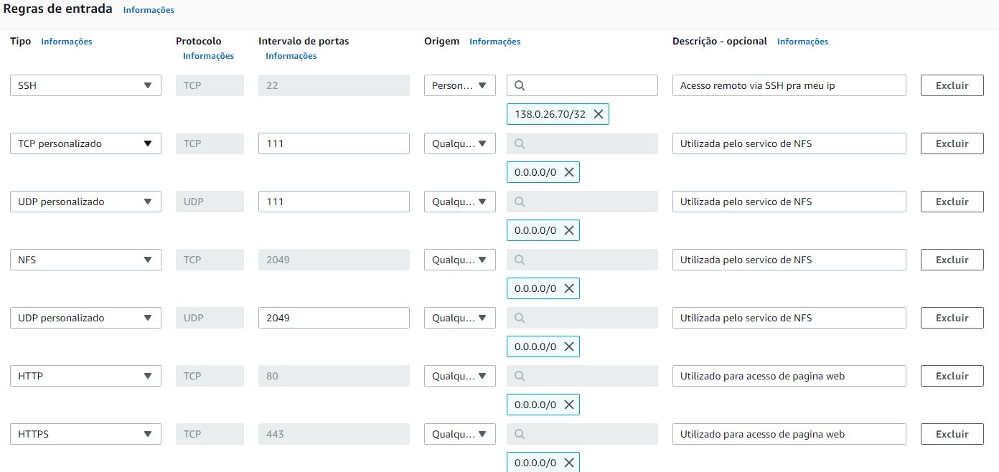

# PB DevSecOps Compass.uol - Atividade de Linux

# Sumário
- [Integrante](#integrante)
- [Sobre a Atividade](#sobre-a-atividade)
- [Iniciando a criação de uma instância no AWS EC2](#iniciando-a-criação-de-uma-instância-no-aws-ec2)
    + [Requisito](#requisito)
    + [Criando a VPC](#criando-a-vpc)
    + [Criando Sub-redes](#criando-sub-redes)
    + [Criando Gateway da Internet](#criando-gateway-da-internet)
    + [Associando gateway de Internet a uma VPC](#associando-gateway-de-internet-a-uma-vpc)
    + [Liberando tráfego de internet na Tabela de Roteamento](#liberando-tráfego-de-internet-na-tabela-de-roteamento)
    + [Criando Grupo de Segurança](#criando-grupo-de-segurança)
- [Referências](#referências)

## Integrante
[Antonio Bezerra](https://github.com/antoniobezerra01)

## Sobre a Atividade

Atividade individual para implementação de requisitos sobre Linux e AWS a serem atendidos, tais como:

  Requisitos AWS:
  1. Gerar uma chave pública para acesso ao ambiente;
  2. Criar 1 instância EC2 com o sistema operacional Amazon Linux 2 (Família t3.small, 16 GB SSD);
  3. Gerar 1 elastic IP e anexar à instância EC2;
  4. Liberar as portas de comunicação para acesso público: (22/TCP, 111/TCP e UDP, 2049/TCP/UDP, 80/TCP, 443/TCP)

  Requisitos no Linux:
  1. Configurar o NFS entregue;
  2. Criar um diretorio dentro do filesystem do NFS com seu nome;
  3. Subir um apache no servidor - o apache deve estar online e rodando;
  4. Criar um script que valide se o serviço esta online e envie o resultado da validação para o seu diretorio no nfs;
  5. O script deve conter - Data HORA + nome do serviço + Status + mensagem personalizada de ONLINE ou offline;
  6. O script deve gerar 2 arquivos de saida: 1 para o serviço online e 1 para o serviço OFFLINE;
  7. Preparar a execução automatizada do script a cada 5 minutos.
  8. Fazer o versionamento da atividade;
  9. Fazer a documentação explicando o processo de instalação do Linux. 

## Iniciando a criação de uma instância no AWS EC2

### Requisito

Para iniciar uma instância no AWS EC2 é imprescindível a utilização de uma conta na AWS. 

### Criando a VPC

Inicie navegando até o console de gerenciamento de VPC localizado no link : https://console.aws.amazon.com/vpc/

Após isso selecione a opção de `Criar VPC` localizada no canto superior da página.

Agora vamos seguir preenchendo alguns campos com suas devidas informações. 
Iremos preencher apenas os campos que necessitam de modificação.

Caso ocorra de houver campos não citados, podem deixar com o valor padrão já alocado.
Então, preencha os campos com os seguintes valores:

#### Recursos a serem criados 
Selecione a opção `Somente VPC` 

#### Tag de nome
Preencha com `Antonio`

#### CIDR IPv4
Preencha com `172.31.0.0/16`

#### Tags
Clique no botão `Adicionar nova tag`

Insira `Project` no primeiro campo e no segundo preencha com `PB`

Clique novamente em `Adicionar nova tag`

Insira `CostCenter`  no primeiro campo e no segundo preencha com `PBCompass`

Com isso finalizamos a criação da VPC. Seguiremos vendo o segundo passo: criação das sub-redes

### Criando Sub-redes

Inicie navegando até o console de gerenciamento de VPC localizado no link : https://console.aws.amazon.com/vpc/

Após isso selecione a opção `Sub-redes` no canto esquerdo.

Estando na página de gerenciamento de sub-redes, clique no botão  `Criar sub-rede` no canto superior direito da página.

Agora vamos seguir preenchendo alguns campos com suas devidas informações.

Então, preencha os campos com os seguintes valores:

#### VPC
Selecione a VPC nomeada de `Antonio` que foi criada anteriormente.

#### Nome da sub-rede
Preencha com `subnet-antonio01`

#### Zona de disponibilizadade
Selecione `us-east-1a`

#### Bloco CIDR IPv4
Preencha com `172.31.0.0/24`

#### Tags
Clique no botão `Adicionar nova tag`

Insira `Project` no primeiro campo e no segundo preencha com `PB`

Clique novamente em `Adicionar nova tag`

Insira `CostCenter`  no primeiro campo e no segundo preencha com `PBCompass`

Com isso finalizamos a criação da sub-rede. Seguiremos vendo o terceiro passo: criação do internet gateway

### Criando Gateway da Internet

Para a instância EC2 ter acesso a internet é necessário associar um gateway da internet a uma VPC.

Inicie navegando até o console de gerenciamento de VPC localizado no link : https://console.aws.amazon.com/vpc/

Após isso selecione a opção `Gateways da internet` no canto esquerdo.

Estando na página de gerenciamento de sub-redes, clique no botão  `Criar gateway da Internet` no canto superior direito da página.

Agora vamos seguir preenchendo alguns campos com suas devidas informações.

Então, preencha os campos com os seguintes valores:

#### Tag de nome
preencha com `gtw-antonio01`

#### Tags
Clique no botão `Adicionar nova tag`

Insira `Project` no primeiro campo e no segundo preencha com `PB`

Clique novamente em `Adicionar nova tag`

Insira `CostCenter`  no primeiro campo e no segundo preencha com `PBCompass`

Com isso finalizamos a criação do gateway da Internet. Seguiremos vendo o terceiro passo: associar o internet gateway a uma VPC.

### Associando gateway de Internet a uma VPC

Após criar um gateway de internet devemos associa-la a uma vpc.

Inicie navegando até a página de gerenciamento de Gateways da Internet.

Clique com o botão direito do mouse sob o gateway de Internet nomeado de `gtw-antonio01`

Agora selecione a opção `Associar à VPC`

Estando na página de Associar gateway da Internet, vamos seguir preenchendo alguns campos com suas devidas informações.

Então, preencha os campos com os seguintes valores:

#### VPCs disponíveis
selecione a com nome `Antonio`

Com isso finalizamos a associção do gateway da Internet. Seguiremos vendo o quarto passo: liberar o tráfego de internet na tabela de roteamento.

### Liberando tráfego de internet na Tabela de Roteamento

Para a instância EC2 ter acesso a internet é necessário liberar o tráfego de internet na tabela de roteamento.

Inicie navegando até o console de gerenciamento de VPC localizado no link : https://console.aws.amazon.com/vpc/

Após isso selecione a opção `Tabelas de rotas` no canto esquerdo.

Estando na página da Tabelas de roteamento, selecione a tabela que está associada à VPC nomeada de `Antonio`.

Após selecionar ela, estará visível no canto inferior o detalhamento referente a essa tabela.

Nessa seção de detalhamento navegue até `rotas` e clique em `Editar rotas`

Na página de editar rotas clique no botão `Adicionar rotas`

Estando na página de Associar gateway da Internet, vamos seguir preenchendo alguns campos com suas devidas informações.

Então, preencha os campos com os seguintes valores:

#### Destino
preencha com `0.0.0.0/0`

#### Alvo
Selecione `Gateway da Internet` e em seguida selecione o gateway da internet nomeado de `gtw-antonio01`

Com isso finalizamos a liberação do tráfego de internet na tabela de roteamento. Seguiremos vendo o quinto passo: Criação do Grupo de Segurança

### Criando Grupo de Segurança

Inicie navegando até o console de gerenciamento de EC2 localizado no link : https://console.aws.amazon.com/ec2/

Após isso, no painel inicial selecione a opção de `Grupos de Segurança`

Acessando a página de grupos de segurança vamos iniciar clicando no botão `Criar grupo de segurança` no canto superior direito.

Estando na página de Criação de Grupo de Segurança, vamos seguir preenchendo alguns campos com suas devidas informações.

Então, preencha os campos com os seguintes valores:

#### Nome do grupo de segurança
preencha com `AntonioSG`

#### Descrição 
preencha com `Grupo de seguranca para atividade de linux`

#### VPC
selecione a que possui o nome `Antonio`

#### Regras de Entradas

Clique em adicionar nova regra quatro vezes.

Após isso preencha da seguinte forma:

Entretanto, na primeira regra coloquei o meu IP público, logo será necessário ajustar de acordo com seu IP.

Obs: Você pode obter seu ip acessando o site: https://meuip.com.br

#### Tags
Clique no botão `Adicionar nova tag`

Insira `Project` no primeiro campo e no segundo preencha com `PB`

Clique novamente em `Adicionar nova tag`

Insira `CostCenter`  no primeiro campo e no segundo preencha com `PBCompass`

Com isso finalizamos a criação do grupo de segurança. Seguiremos vendo o sexto passo: Criação do par de chaves

## Referências
